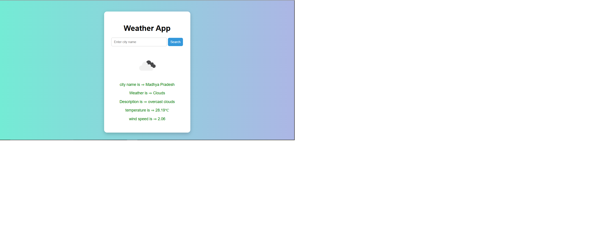

# 🌦️ Weather App

A simple and responsive weather app built using **HTML**, **CSS**, and **JavaScript**. It fetches real-time weather data using the **OpenWeatherMap API**.

---

## 🔍 Features

- ✅ Search for any city worldwide
- ✅ Displays:
  - City Name
  - Current Weather
  - Weather Description
  - Temperature in Celsius
  - Wind Speed
  - Weather Icon
- ✅ Error handling for invalid city names

---

## 📸 Screenshot

---

## 🛠️ Tech Stack

- HTML
- CSS
- JavaScript (Fetch API)
- OpenWeatherMap API

